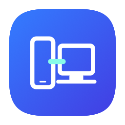
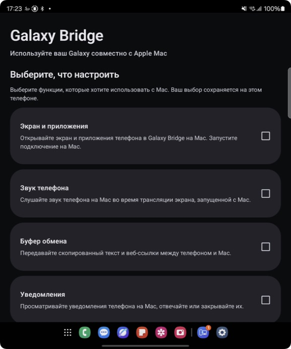
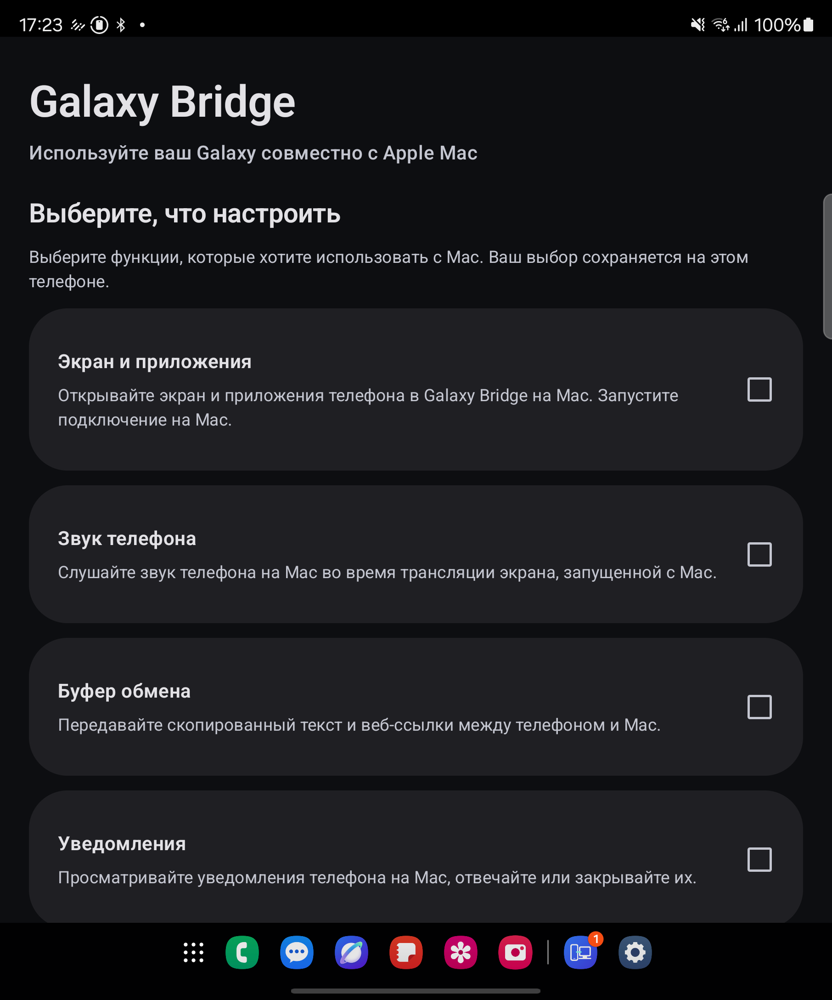
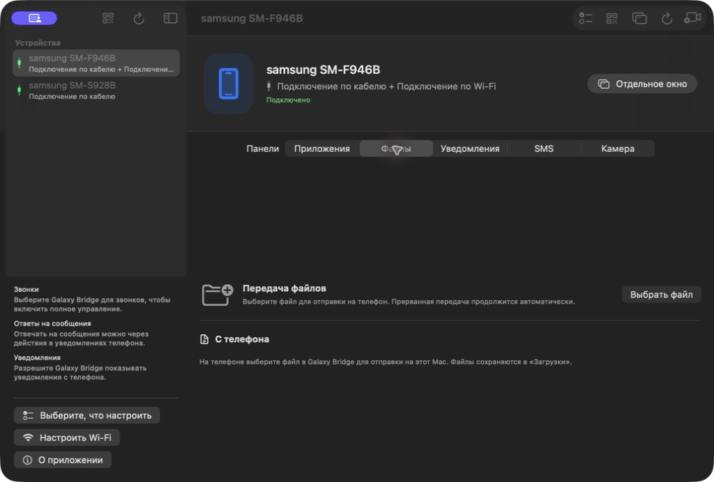

<div align="center">
  
  <h1>Galaxy Bridge</h1>
  <p>Your Samsung phone, at home on your Mac.<br>Ваш Samsung — рядом с вами на Mac.</p>
  <p>
    <a href="https://github.com/XopMC/GalaxyBridge/releases/tag/0.1.0"></a>
    
    
    
    <a href="LICENSE"></a>
  </p>
  <p><a href="#english">English</a> · <a href="#russian">Русский</a></p>
  <p><a href="https://github.com/XopMC/GalaxyBridge/releases/tag/0.1.0">Download / Скачать 0.1.0</a></p>
</div>

<a id="english"></a>

## English

### Overview

Galaxy Bridge connects a Samsung Android phone to a Mac for screen control, audio, notifications, clipboard, and file transfers. It works locally, without an account or cloud relay. A shared One UI-inspired icon and system-language interfaces keep both apps familiar.

**0.1.0 is a prerelease** for Apple Silicon Macs and Samsung Android phones. See the [release notes](docs/public/release-notes-0.1.0.md).

### Screenshots

| Phone screen on macOS | Android helper | File transfer |
|:---:|:---:|:---:|
|  |  |  |

### Features

- **Phone screen on your Mac:** USB or Wireless ADB mirroring with mouse and keyboard control, phone audio, and Mac-side recording. Audio availability depends on the phone and app.
- **Separate app windows:** choose a phone app in the catalog to open it in its own Mac window through ADB; compatibility depends on the Android app.
- **Notifications:** read phone notifications and use actions or replies when Android makes them available.
- **Clipboard:** share supported clipboard content between paired devices.
- **Files in both directions:** resumable transfers with integrity checks; receive into Mac Downloads or the phone’s `Download/GalaxyBridge` folder.
- **Choose your features:** saved setup choices and permissions requested for the features you select.
- **Ready for everyday installation:** ADB is included in the Mac app; users do not need Homebrew or the Android SDK.
- **System language:** English, Russian, German, French, Spanish, Portuguese, Arabic, Chinese (Simplified/Traditional), Japanese, and Korean, with English fallback. Translation review by native speakers is welcome.

### Download and install

1. Download the **DMG and APK** from [release 0.1.0](https://github.com/XopMC/GalaxyBridge/releases/tag/0.1.0).
2. Open the DMG and drag **Galaxy Bridge** into **Applications**. Install the APK on your Android phone.
3. Open both apps, choose the features you want, and follow pairing and permission prompts. For the initial USB mirror, enable USB debugging and approve this Mac on your phone.

Requires **macOS 14+ on Apple Silicon** and **Android 12+**. The Mac download is ad-hoc signed and **not notarized by Apple**; see [installation and troubleshooting](docs/public/install.md) for the per-app Gatekeeper procedure. Android permissions and debugging authorization remain under your control.

### Build

The public source provides a CMake entry point for the Swift, Kotlin, and Rust components. Install the [build prerequisites](docs/public/build.md), then run:

```sh
cmake --preset macos-arm64-release
cmake --build --preset macos-arm64-release --target native macos-app android-apk
```

Use `package` for distribution artifacts. The `check` target builds native prerequisites and runs source tests without installing apps or operating a phone. See the [build guide](docs/public/build.md) for signing inputs, output paths, and validation limits. The 0.1.0 downloads were prepared before the public CMake build integration; a source rebuild is a separate artifact.

### Limitations

- **Validation is still incomplete:** Wi-Fi reliability, clean-Mac installation, long runs, and the wider device matrix remain to be verified.
- **Full SMS history/direct sending and virtual webcam activation are not included in 0.1.0.** Notification replies depend on Android exposing a reply action.
- **Audio and app-window compatibility vary** by phone and application; some recordings contain video only.
- **No Apple notarization:** the Mac download uses an ad-hoc signature. Intel Macs are not supported by this release.

### TODO

- [ ] Complete Wi-Fi interruption/recovery and sustained-use testing.
- [ ] Validate installation on a clean Mac without development tools and expand the device matrix.
- [ ] Review translations with native speakers and independently validate the public source-build artifacts.
- [ ] Implement full SMS support and finish virtual webcam distribution in future releases.

Follow the [roadmap](docs/public/roadmap.md) or contribute a focused test result or fix through the [contributing guide](CONTRIBUTING.md).

### License and author

Bug reports, focused fixes, device testing, and translation improvements are welcome. Start with [contributing](CONTRIBUTING.md), [build instructions](docs/public/build.md), or the [roadmap](docs/public/roadmap.md). Please keep personal content and credentials out of issues.

Galaxy Bridge’s own code is available under the [MIT License](LICENSE). Third-party components retain their [respective licenses](third_party/LICENSES.md).

Created by **Mikhail Khoroshavin ([XopMC](https://github.com/XopMC))**. Galaxy Bridge is an independent project and is not affiliated with Samsung or Apple.

[Back to top](#english) · [Русский ↓](#russian)

---

<a id="russian"></a>

## Русский

### Обзор

Galaxy Bridge связывает Samsung на Android с Mac: управление экраном телефона, звук, уведомления, буфер обмена и передача файлов. Всё работает локально, без аккаунта и облачного ретранслятора. Общая иконка в духе One UI и интерфейс на системном языке объединяют оба приложения.

**0.1.0 — предварительный выпуск** для Mac с Apple Silicon и телефонов Samsung на Android. Подробнее — в [заметках к выпуску](docs/public/release-notes-0.1.0.md#russian).

### Скриншоты

| Экран телефона на macOS | Помощник Android | Передача файлов |
|:---:|:---:|:---:|
|  |  |  |

### Возможности

- **Экран телефона на Mac:** трансляция через USB или Wireless ADB, управление мышью и клавиатурой, звук телефона и запись на Mac. Доступность звука зависит от телефона и приложения.
- **Отдельные окна приложений:** выберите приложение телефона в каталоге, чтобы открыть его в собственном окне Mac через ADB; совместимость зависит от приложения Android.
- **Уведомления:** просмотр уведомлений телефона, действия и ответы, когда их предоставляет Android.
- **Буфер обмена:** передача поддерживаемого содержимого между сопряжёнными устройствами.
- **Файлы в обе стороны:** передача с возобновлением и проверкой целостности; полученные файлы сохраняются в «Загрузки» на Mac или `Download/GalaxyBridge` на телефоне.
- **Выбор возможностей:** сохранение настроек и запрос разрешений для выбранных функций.
- **Обычная установка:** ADB встроен в приложение для Mac; пользователю не нужны Homebrew и Android SDK.
- **Системный язык:** английский, русский, немецкий, французский, испанский, португальский, арабский, китайский (упрощённый/традиционный), японский и корейский. Для остальных языков используется английский. Приветствуем проверку переводов носителями языка.

### Скачать и установить

1. Скачайте **DMG и APK** со страницы [выпуска 0.1.0](https://github.com/XopMC/GalaxyBridge/releases/tag/0.1.0).
2. Откройте DMG и перенесите **Galaxy Bridge** в **«Программы»**. Установите APK на телефон.
3. Откройте оба приложения, выберите нужные функции и следуйте подсказкам сопряжения и разрешений. Для первого подключения экрана по USB включите отладку по USB и подтвердите доступ для этого Mac на телефоне.

Требуются **macOS 14+ на Apple Silicon** и **Android 12+**. Приложение для Mac имеет локальную ad-hoc подпись и **не нотарифицировано Apple**; порядок разрешения запуска конкретного приложения описан в [инструкции](docs/public/install.md#russian). Системные разрешения Android и доступ для отладки остаются под вашим контролем.

### Сборка

В публичных исходниках есть единая точка входа CMake для компонентов на Swift, Kotlin и Rust. Установите [зависимости](docs/public/build.md#russian), затем выполните:

```sh
cmake --preset macos-arm64-release
cmake --build --preset macos-arm64-release --target native macos-app android-apk
```

Цель `package` подготавливает установочные файлы. Цель `check` собирает необходимые нативные компоненты и запускает проверки исходников без установки приложений и действий на телефоне. [Инструкция по сборке](docs/public/build.md#russian) описывает параметры подписи, каталоги результатов и границы проверки. Файлы выпуска 0.1.0 подготовлены до интеграции публичной сборки CMake; повторная сборка исходников создаёт отдельные артефакты.

### Ограничения

- **Проверка ещё не завершена:** предстоит подтвердить надёжность Wi-Fi, установку на чистый Mac, длительную работу и расширенную матрицу устройств.
- **Полная история SMS, прямая отправка SMS и активация виртуальной веб-камеры не входят в 0.1.0.** Ответ на уведомление зависит от наличия действия ответа в Android.
- **Звук и совместимость отдельных окон зависят** от телефона и приложения; некоторые записи содержат только видео.
- **Нотарификации Apple нет:** у приложения для Mac локальная ad-hoc подпись. Intel Mac в этом выпуске не поддерживается.

### TODO

- [ ] Завершить проверки обрывов и восстановления Wi-Fi, а также длительной работы.
- [ ] Проверить установку на чистый Mac без инструментов разработчика и расширить матрицу устройств.
- [ ] Проверить переводы с носителями языка и независимо проверить артефакты публичной сборки исходников.
- [ ] Реализовать полноценную работу с SMS и довести распространение виртуальной веб-камеры в будущих выпусках.

Следите за [планами](docs/public/roadmap.md#russian) или присылайте результаты проверок и небольшие исправления по [правилам участия](CONTRIBUTING.md).

### Лицензия и автор

Будем рады сообщениям об ошибках, небольшим исправлениям, проверкам на устройствах и улучшениям переводов. Начните с [участия в разработке](CONTRIBUTING.md), [инструкции по сборке](docs/public/build.md#russian) или [планов](docs/public/roadmap.md#russian). Не добавляйте в обращения личное содержимое и секреты.

Собственный код Galaxy Bridge распространяется по [лицензии MIT](LICENSE). Для сторонних компонентов действуют [их лицензии](third_party/LICENSES.md).

Автор — **Михаил Хорошавин ([XopMC](https://github.com/XopMC))**. Galaxy Bridge — независимый проект, не связанный с Samsung или Apple.

[К началу русского раздела](#russian) · [English ↑](#english)
